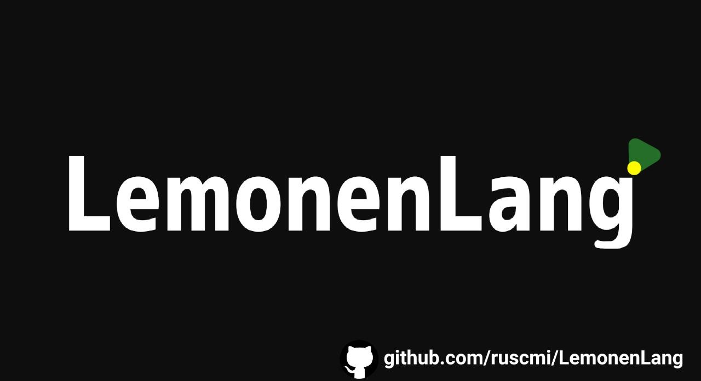

# Hello!
Russian [README.ru](README.ru.md)

  

# LemonenLang
Greetings. LemonenLang is my C++ interpreter with the simplest string parsing logic. At the moment, it is quite simple in logic and works quite quickly. If you like my project, if you want, give me a star, I will be very happy about it. 
[Example file](calc.lmn) (run in code) 
# Logo

  

# How do I install and compile sources?
First, copy the repository
`git clone https://github.com/ruscmi/LemonenLang.git`
Go to the source folder
in linux distros
`cd ~/src`
or just change the location where the sources are located
then compile all the files and build lmnlang
`g++ main.cpp logic.h lmnlang.cpp -o lmnlang`
next, we run
`./lmnlang`
thank you if you follow these instructions,
since the code is completely open,
you can make your own changes to it,
thank you for using it.

Under Windows, there is a separate compiled file [lemon.exe](lemon.exe) you just run it and everything works for you, but there is only one warning: 
you may have an antivirus yelling that this is some kind of virus, this is normal for files without any reputation for pleasant use... (probably)
