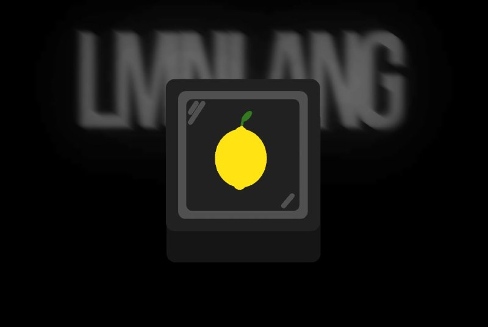
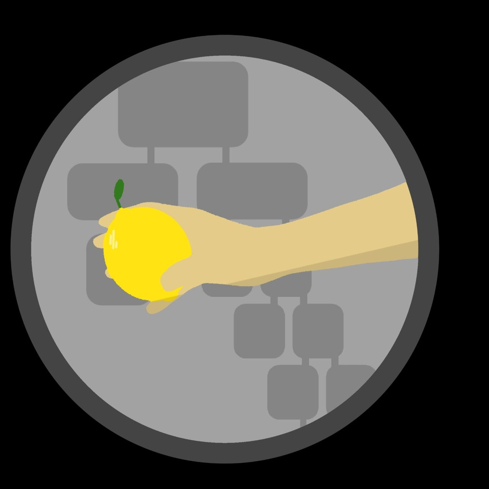

# 🍋 LemonenLang

<p align="center">
	
</p>

lmnlang is a fast and lightweight interpreter that works in C++ At the moment, the project is just being made, I wrote a lexer and am actively writing a parser, if you want to test my project, then just copy the sources: ```git clone https://github.com/ruscmi/LemonenLang ``` Then compile the source code via a bash script ```bash chmod +x builder.sh ./builder.sh ```

# Logo

<p align="center">
	
</p>
